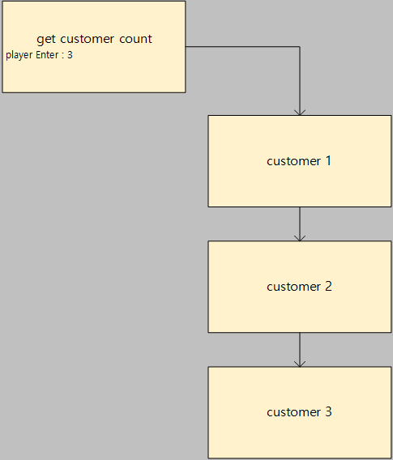
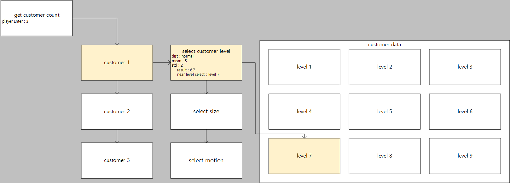
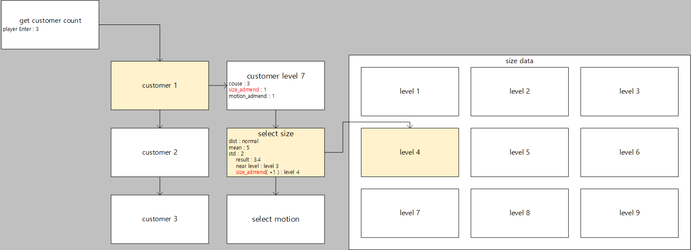
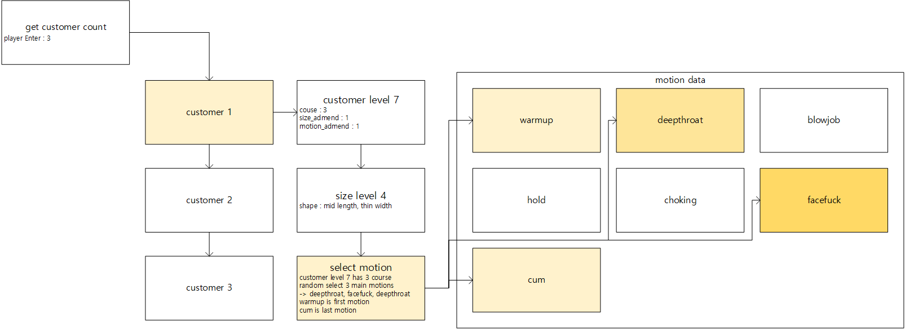
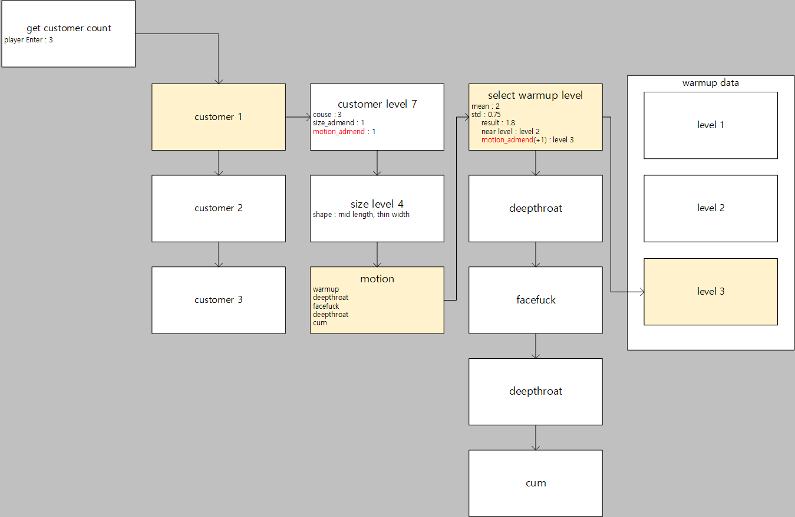
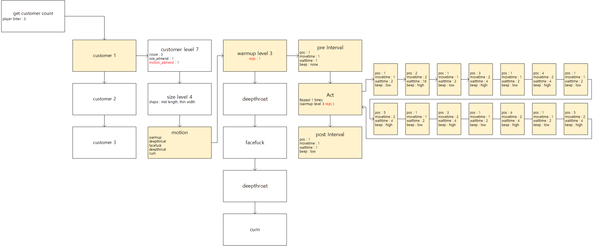
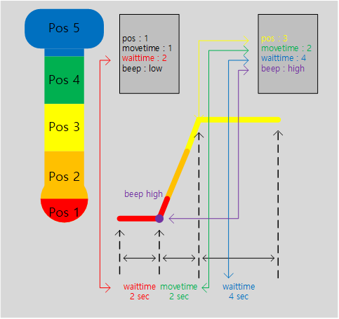

# Configuration Reference

## Random Mode

In random mode, **customer**, **size**, and **motion** are each determined randomly.

### Distribution Types

There are two distribution types available: **Normal** and **Uniform**.

#### Normal Distribution

- Activated when `dist` is set to `"normal"`
- A single value is sampled from a normal distribution using `mean` and `std`
- The `level` in `data` closest to the sampled value is selected
- If multiple levels are equally close, one is chosen via uniform distribution

#### Uniform Distribution

- Activated when `dist` is set to `"uniform"`
- A single value is sampled from a uniform distribution over the range `[mean - std, mean + std)`
- The `level` in `data` closest to the sampled value is selected
- If multiple levels are equally close, one is chosen via uniform distribution

---

### Weights

Each **customer** entry may define `size_admend` and `motion_admend` fields.
These values are added to the randomly sampled number before the closest level is selected.

---

### Motion

#### Selection
Motion type is chosen uniformly at random from all available motion types.

#### Repetition
A motion repeats for the number of **courses** defined in the customer.
`warmup` and `cum` do not count toward the course total.

#### Process
```
warmup → motion (× course count) → cum
```

---

### Act

#### Selection
Each motion has multiple levels. A level is selected according to the configured distribution.

#### Repetition
An act repeats for the number of `reps` defined in the selected level.

#### Process
```
preInterval → act (× reps) → postInterval
```

#### Behavior

| Field | Description |
|---|---|
| `pos` | Target depth position. **1** = shallowest, **5** = deepest |
| `move time` | Duration to move to the target `pos` |
| `wait time` | Duration to hold at the target `pos` |
| `beep` | A beep sound plays at the start of each act |

---

### Repetition Hierarchy

```
Customers (× customer count)
  └─ Courses (× course count per customer)
       └─ Acts (× reps per motion level)
```

---

## Example Walkthrough (Random Mode)

This section walks through a complete example of how Random Mode operates step by step.

---

### Step 1 — Customer Count Input



The program receives the number of customers from the user.
The specified number of customers will be served.

---

### Step 2 — Customer Level Selection



The customer level is determined according to the configured random distribution.

In this example, a normal distribution is used with a mean of **5** and a standard deviation of **2**.
A value of **6.7** was sampled, and the closest customer level **7** was selected.

---

### Step 3 — Size Level Selection



The size level is determined according to the configured random distribution.

In this example, a normal distribution is used with a mean of **5** and a standard deviation of **2**.
A value of **3.4** was sampled, and the closest size level **3** was selected.
However, since the selected customer (level 7) has a `size_admend` of **+1**,
the final size level selected is **4**.

---

### Step 4 — Motion Selection



The motion to perform is selected via uniform random selection.
Motions themselves do not have levels.
The number of motions to perform is determined by the `course` value defined in the customer.
Duplicate selections are allowed.
`warmup` and `cum` are excluded from random selection — `warmup` is always the first motion and `cum` is always the last.

In this example, **deepthroat**, **facefuck**, and **deepthroat** were selected.
Therefore, the motion sequence proceeds as:

```
warmup → deepthroat → facefuck → deepthroat → cum
```

---

### Step 5 — Motion Level Selection



The motion level is determined according to the configured random distribution.

In this example, the random settings for `warmup` follow a normal distribution with a mean of **2** and a standard deviation of **0.75**.
A value of **1.8** was sampled, and the closest `warmup` level **2** was selected.
However, since the selected customer (level 7) has a `motion_admend` of **+1**,
the final motion level selected is `warmup` level **3**.

---

### Step 6 — Motion Execution



Each motion proceeds in the following order:

```
preInterval → act (× reps) → postInterval
```

The act is repeated according to the `reps` value defined in the selected motion level.

---

### Step 7 — Act Detail



Each act executes in the following sequence:

1. A beep plays at the pitch defined by the `beep` field.
2. The position moves to the target `pos` over the duration of `move time`.
3. The position holds at `pos` for the duration of `wait time`.
4. The next act begins.

In this example:
- Starting at pos **1**, it waits for **2 seconds**.
- A high beep plays, then the position moves to pos **3** over **2 seconds**.
- It holds at pos **3** for **4 seconds**.
- The next act is then executed.

---

## Sequence Mode

> Documentation in progress.

---

[← Back to README](../README.md)
